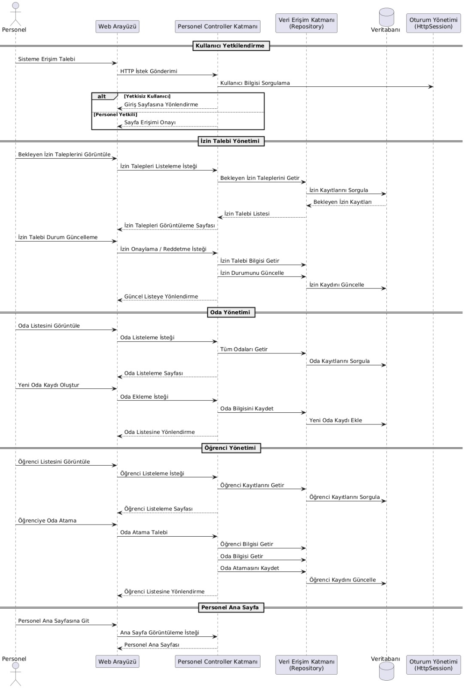
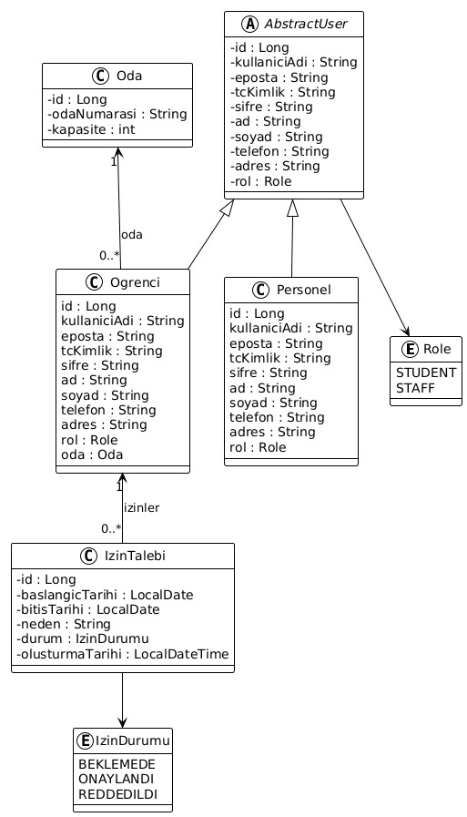
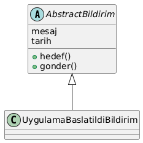
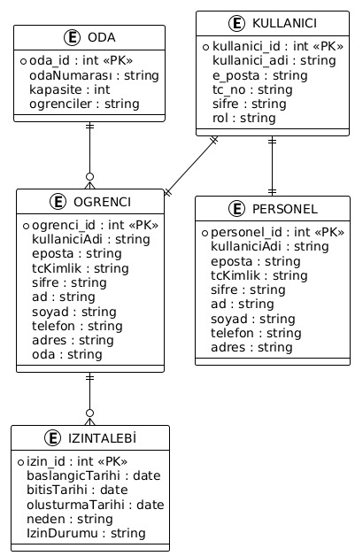

# yurt_yonetim_sistemi
Yurt Yönetim Sistemi
Bu proje, bir yurt işletmesinde öğrenci ve personel işlemlerinin dijital ortamda yönetilmesini amaçlayan bir Yurt Yönetim Sistemidir. Sistem üzerinden kullanıcılar, kullanıcı adı ve şifre ile giriş yapabilmekte; kişisel bilgilerini görüntüleyip güncelleyebilmektedir. Öğrenciler, izin talebi oluşturabilmekte ve mevcut oda bilgilerine erişebilmektedir. Personel ise öğrenciler tarafından oluşturulan izin taleplerini onaylayabilmekte, oda değişikliği işlemlerini gerçekleştirebilmekte, yeni öğrenci ve oda ekleme gibi yönetimsel işlemleri sistem üzerinden kolayca yapabilmektedir.
________________________________________
Projenin amacı
Sistem sayesinde öğrenci ve personel bilgilerinin düzenli ve güvenli bir şekilde yönetilmesi, oda yerleştirme ve değişiklik işlemlerinin daha kontrollü bir biçimde yapılması ve izin süreçlerinin kolayca takip edilebilir hâle getirilmesi hedeflenmiştir. Böylece manuel işlemlerden kaynaklanan zaman kaybı ve karışıklıkların azaltılması amaçlanmaktadır.
________________________________________
Kullanıcı Rolleri
Öğrenci
•	Kullanıcı Adı   ve şifre ile giriş yapabilir
•	Kendi profil bilgilerini görüntüleyebilir ve güncelleyebilir.
•	Kaldığı oda bilgisini görebilir.
•	Aynı odada kalan diğer öğrencilerin temel ve iletişim bilgilerini görüntüleyebilir.
•	İzin talebi oluşturabilir ve izin durumunu takip edebilir.
•	Güvenli şekilde çıkış yapabilir.
Personel
•	Kullanıcı Adı   ve şifre ile giriş yapabilir
•	Öğrenci ve yeni oda  ekleme işlemi yapabilir.
•	Öğrencileri odalara atayabilir.
•	Oda bilgilerini ve doluluk durumlarını görüntüleyebilir.
•	Öğrencilerin izin taleplerini görüntüleyebilir ve reddedebilir veya kabul edebilir bu da direkt öğrenci paneline düşerek öğrenci izin geçmişinde görüntülenir.
     
Kullanılan Teknolojiler
•	Java 11
•	Spring Boot
•	Spring MVC
•	Spring Data JPA (Hibernate)
•	MySQL
•	Thymeleaf
•	HTML / CSS
•	Maven
________________________________________
Veritabanı Yapısı
Projede MySQL veritabanı kullanılmıştır.
Temel tablolar:
•	ogrenciler
•	personeller
•	odalar
•	izin_talebi
Öğrenciler ve odalar arasında bire-çok (Many-to-One) ilişki bulunmaktadır.
________________________________________
Güvenlik ve Oturum Yönetimi
•	Giriş yapan kullanıcı bilgileri HTTP Session üzerinden tutulmaktadır.
•	Kullanıcı rolüne göre (öğrenci / personel) sayfa erişimleri sınırlandırılmıştır.
•	Çıkış yapıldığında session sonlandırılmaktadır.
•	Giriş yapılmadan korumalı sayfalara erişim engellenmiştir.
________________________________________

▶️ Projeyi Çalıştırma
1.	Projeyi klonlayın:
git clone https://github.com/kullaniciadi/yurt-yonetim-sistemi.git
2.	MySQL’de yurt isimli bir veritabanı oluşturun.
3.	application.properties dosyasında veritabanı bilgilerinizi girin:
spring.datasource.url=jdbc:mysql://localhost:3306/yurt
spring.datasource.username=root
spring.datasource.password=MYSQL_SIFRENIZ
Uyarı:MySQL şifrenizi projenin properties kısmından değiştirmeyi unutmayın.
4.	Projeyi çalıştırın:
mvn spring-boot:run
5.	Tarayıcıdan erişin:
http://localhost:8080/login
Notlar
•	Bu proje eğitim amaçlı geliştirilmiştir.
•	Geliştirmeye ve yeni özellikler eklemeye açıktır.
•	Kod yapısı MVC mimarisine uygun olarak düzenlenmiştir.

## UML Diyagramları

### Use Case Diyagramı

### Sequence Diyagramı

### Abstract User Diyagramı

### Abstract Bildirim Diyagramı

### Veritabanı Diyagramı

Geliştiriciler
GRUP15
Beyzanur AKGÜÇ
Zülal ÖZCAN  https://github.com/Zulalzcn
Zelal SALMAN  https://github.com/ZelalSalman

